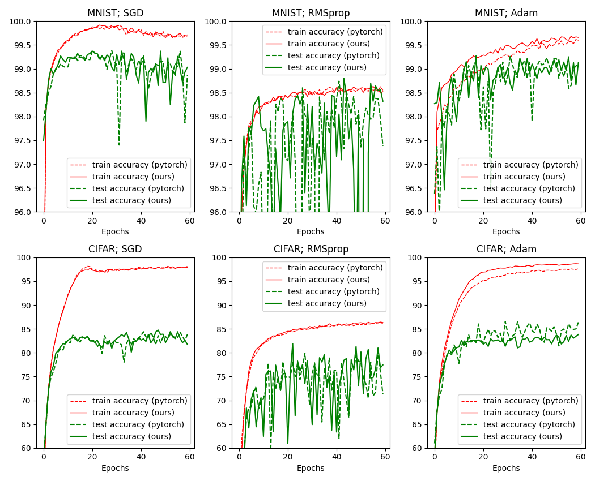
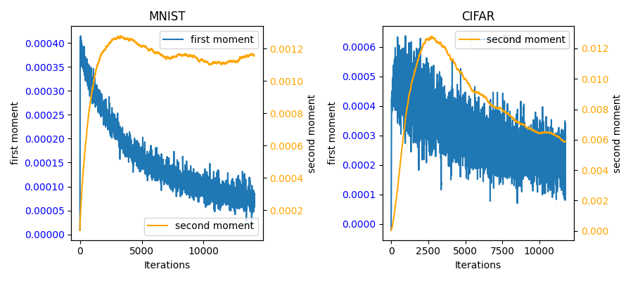

# MATH-4420-pytorch-optimizers

This repository contains the code for Wes Robbins' and Brendan Gould's final project in MATH 4/5420.

Contains custom implementations of various optimizers commonly used with gradient descent.
These optimizers comply with the pytorch API by subclassing `torch.optim.Optimizer`.
Driver programs are also included to test each optimizer using an image classifier on the MNIST and CIFAR10 datasets.

## File Organization
- `optimizers.py` contains custom optimizer implementations
- `run.py` is the train and test script
- `resnet.py` contains backbone model implementation

## Results
Train and test accuracy comparisons between our implementations and the pytorch implmentations.

First and second moment (average over all parameters) throughout training for our Adam implementation.
